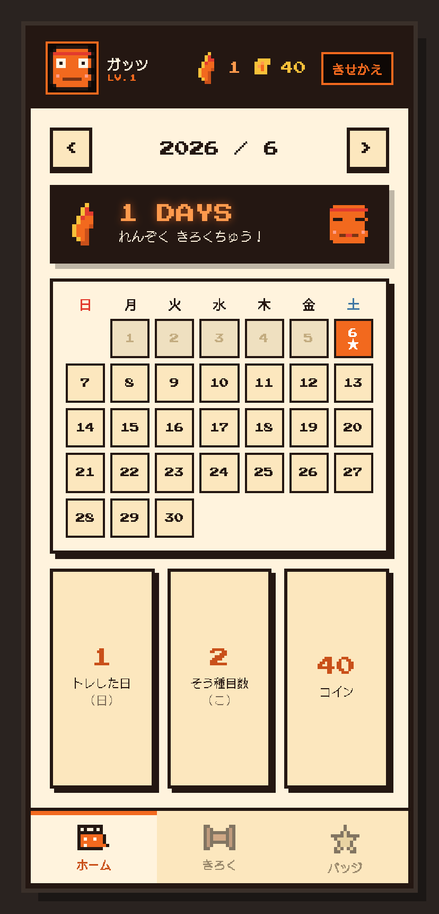
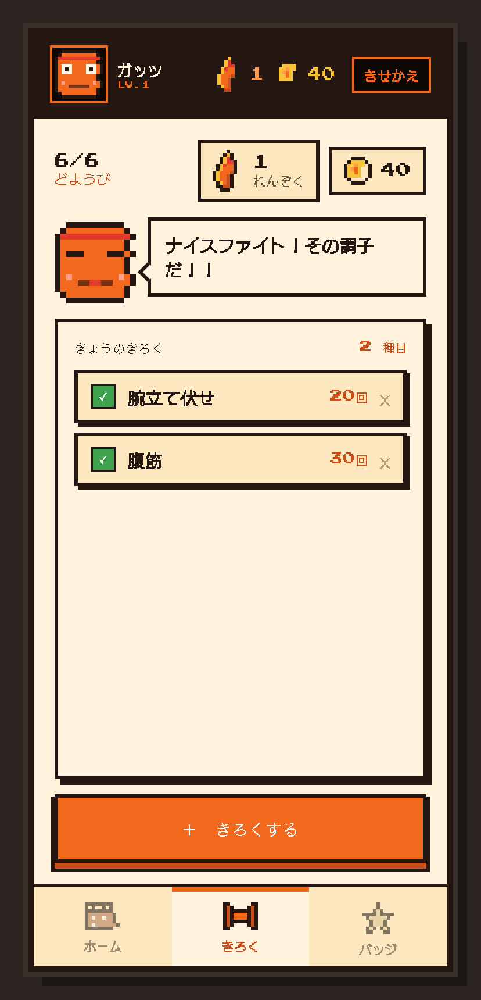
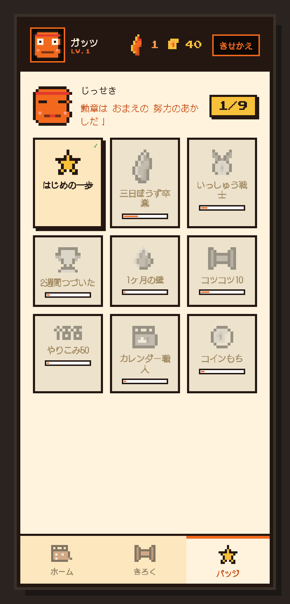

# kintore-go 💪

レトロピクセルアート風の **筋トレ継続アプリ**。毎日の運動を記録して、ストリーク（連続日数）・コイン・バッジで継続をゲーミフィケーションします。

Go + SQLite のシンプルなバックエンドと、React（Babel standalone）のフロントエンドで構成された、ビルド不要のセルフホスト Web アプリです。

## スクリーンショット

| ホーム（カレンダー） | きろく | バッジ／実績 |
| :---: | :---: | :---: |
|  |  |  |

## 特徴

- 📅 **カレンダー（ホーム）** — 当月の記録状況をひと目で確認
- 📝 **きろく** — 種目・回数・単位を入力して今日のトレーニングを記録
- 🔥 **ストリーク** — 連続記録日数を自動カウント
- 🏅 **バッジ／実績** — 「はじめの一歩」「いっしゅう戦士」「1ヶ月の壁」など、stats から自動アンロック
- 🪙 **コイン** — 記録するほど貯まる（1セット = 20コイン）
- 🐾 **キャラクター選択** — `guts` / `homura` / `wakaba` / `ouji` / `nyatore` / `aqua` の6体から相棒を選択

## 必要環境

- [Go](https://go.dev/) 1.25 以上
- ブラウザ（フロントエンドは CDN から React / Babel を読み込むため、初回はネット接続が必要）

SQLite ドライバは [`modernc.org/sqlite`](https://pkg.go.dev/modernc.org/sqlite)（cgo 不要のピュア Go 実装）を使用しているため、C コンパイラは不要です。

## 起動方法

```sh
make run
```

起動後、ブラウザで http://localhost:4949 を開きます。

初回起動時にカレントディレクトリへ `kintore.db`（SQLite、WAL モード）が自動作成されます。

### バイナリをビルドする場合

```sh
make build   # ./kintore-go を生成
./kintore-go
```

> `make` を使わない場合は `go run .` / `go build -o kintore-go .` でも同じです。

## make コマンド

開発タスクは `Makefile` にまとめてあります。

| コマンド     | 内容                              |
| ------------ | --------------------------------- |
| `make run`   | サーバーを起動（`go run .`）       |
| `make build` | バイナリ `kintore-go` をビルド     |
| `make test`  | テストを実行（`go test ./...`）     |
| `make fmt`   | コード整形（`go fmt ./...`）        |
| `make vet`   | 静的解析（`go vet ./...`）          |
| `make tidy`  | 依存整理（`go mod tidy`）           |
| `make clean` | ビルド成果物を削除                 |

## テスト

```sh
make test
```

`main_test.go` に API ハンドラのテストが含まれています（status / add / delete / character）。

## API

すべて JSON。`POST` / `DELETE` 系はレスポンスとして最新の `GET /api/status` と同じ全状態を返すため、フロント側は1往復で UI を更新できます。

| Method   | Path                  | 説明                                       |
| -------- | --------------------- | ------------------------------------------ |
| `GET`    | `/api/status`         | 今日の状態・当月の記録・統計をまとめて取得 |
| `POST`   | `/api/entries`        | 記録を追加 `{name, amount, unit}`          |
| `DELETE` | `/api/entries/{id}`   | 今日の記録を削除                           |
| `GET`    | `/api/character`      | 選択中のキャラクターを取得                 |
| `POST`   | `/api/character`      | キャラクターを変更 `{character}`           |

<details>
<summary><code>GET /api/status</code> レスポンス例</summary>

```json
{
  "today_done": true,
  "streak": 8,
  "today_entries": [
    { "id": 1, "date": "2026-06-06", "name": "腕立て伏せ", "amount": 20, "unit": "回" }
  ],
  "month": {
    "2026-06-01": [{ "id": 2, "date": "2026-06-01", "name": "腹筋", "amount": 30, "unit": "回" }]
  },
  "total_sets": 11,
  "done_days": 6,
  "coins": 340,
  "character": "guts",
  "onboarded": true
}
```

</details>

## プロジェクト構成

```
kintore-go/
├── main.go            # HTTP サーバ・API ハンドラ・SQLite アクセス
├── main_test.go       # API テスト
├── kintore.db         # SQLite データベース（自動生成・gitignore 済み）
├── static/            # フロントエンド（ビルド不要、Babel standalone で JSX を実行）
│   ├── index.html     # phone 枠の HTML、React / Babel / 各 JSX を読み込み
│   ├── ui.jsx         # 共有 UI プリミティブ（PixelArt, RetroPanel, RetroButton 等）
│   ├── mascots.jsx    # キャラクターデータ + CharacterSelect
│   ├── homeInput.jsx  # きろく画面（種目入力・記録リスト）
│   ├── calendar.jsx   # カレンダー画面
│   ├── badges.jsx     # バッジ／実績画面
│   └── app.jsx        # 状態管理・API 接続・ナビゲーション
└── docs/              # 仕様・実装プラン
```

## データモデル

```sql
CREATE TABLE entries (
  id     INTEGER PRIMARY KEY AUTOINCREMENT,
  date   TEXT    NOT NULL,  -- "2026-01-02" 形式
  name   TEXT    NOT NULL,
  amount REAL    NOT NULL,
  unit   TEXT    NOT NULL
);

CREATE TABLE settings (
  key   TEXT PRIMARY KEY,
  value TEXT NOT NULL      -- 例: ('character', 'guts')
);
```

- **「今日やった」** = `entries` に今日の日付のレコードが1件以上ある
- **ストリーク** = 今日から連続して `entries` が存在する日数（Go 側で計算）
- **バッジのアンロック** = フロント側で stats から判定（DB には保存しない）
- **コイン** = `entries` の総件数 × 20

## ライセンス

[MIT License](LICENSE) © 2026 Takumi Sato
